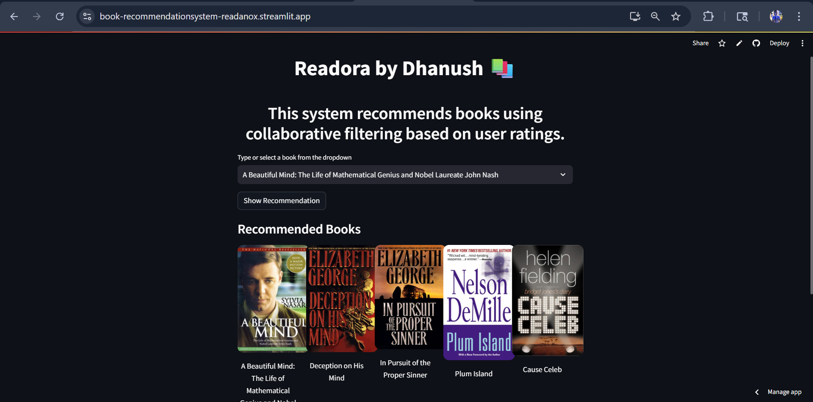

# 📚 Readora — Book Recommendation System

##  Project Description

A Machine Learning-based **Book Recommendation System** that suggests books similar to the one selected by the user.

The system uses **Collaborative Filtering** and **Cosine Similarity** to recommend books based on user ratings.

---

## ✨ Features
- 📚 Smart book recommendations using ML
- ⚡ Fast and interactive Streamlit UI
- 🖼️ Displays book cover images

## 🚀 Live Demo

🔗 https://book-recommendationsystem-readanox.streamlit.app/

---

## 📸 App Screenshot

**

---

## 📊 Dataset

The dataset contains information about **books, users, and ratings**.

📌 Dataset Source:
https://www.kaggle.com/datasets/ra4u12/bookrecommendation

---

## 🛠️ Technologies Used

* Python
* Pandas
* NumPy
* Scikit-learn
* Streamlit
* Jupyter Notebook

---

## 🤖 Machine Learning Model

The recommendation system uses:

👉 **Collaborative Filtering with K-Nearest Neighbors (KNN)**
to find books similar to the selected book.

---

## ⚙️ How It Works

1. Load book, user, and rating datasets
2. Clean and preprocess the data
3. Create a user-book rating matrix
4. Apply cosine similarity
5. Use KNN model to find similar books
6. Display recommendations using Streamlit UI

---

## 📂 Project Structure

```text
Book-Recommender-System
│
├── artifacts/
│   ├── model.pkl
│   ├── book_names.pkl
│   ├── book_pivot.pkl
│   └── final_rating.pkl
│
├── app.py
├── requirements.txt
├── runtime.txt
├── .gitignore
└── README.md
```

---

## ▶️ How to Run the Project

```bash
git clone https://github.com/your-username/book-recommender-system.git
cd book-recommender-system

pip install -r requirements.txt
streamlit run app.py
```

---

## 🌐 Application Interface

The web interface allows users to:

* 📚 Select a book
* 🔍 Get similar book recommendations
* 🖼️ View book cover images

---

## 🚧 Future Improvements

* 🔮 Hybrid recommendation system
* 🎨 Improved UI/UX
* 🔐 User authentication system

---

## 👨‍💻 Author

**Dhanush**

🔗 GitHub: https://github.com/DhanushGowda22

---

## ⭐ Support

If you found this project helpful, consider giving it a ⭐ on GitHub!
